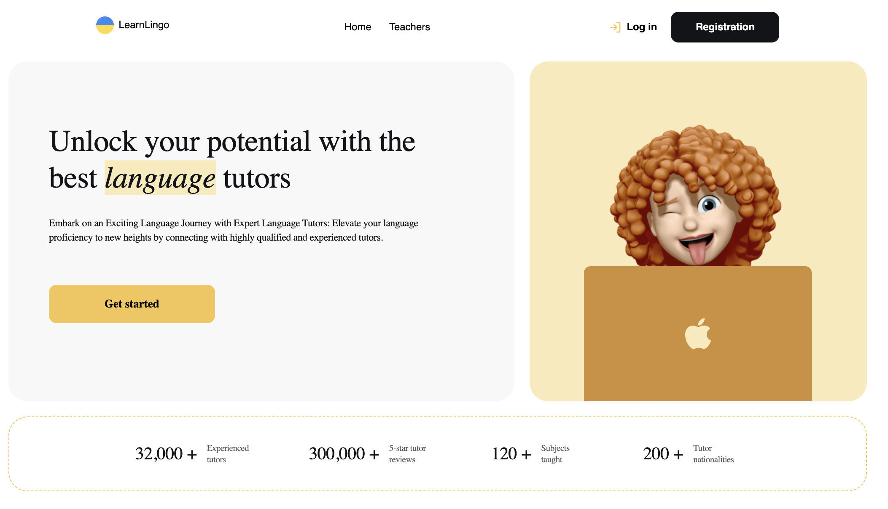
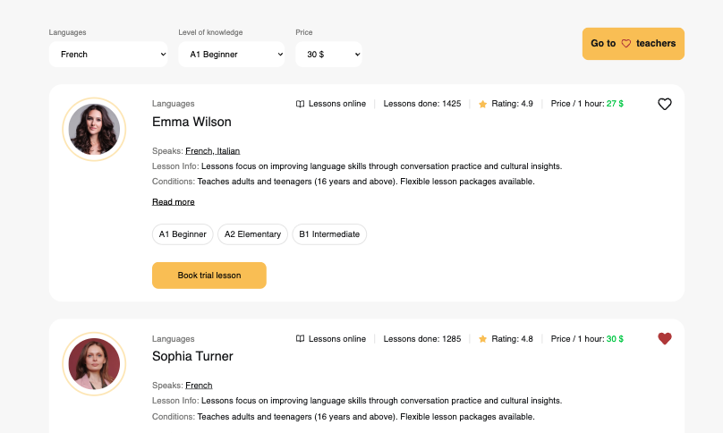
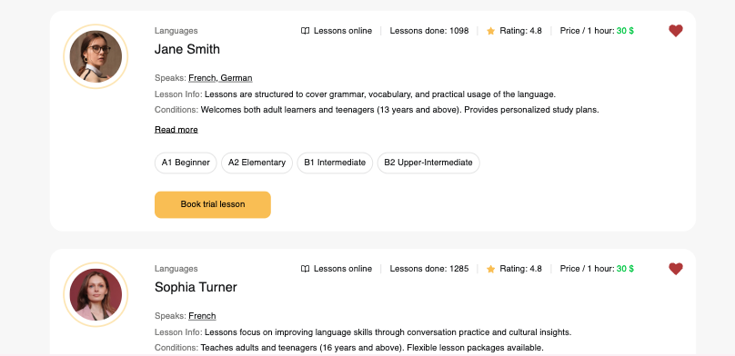
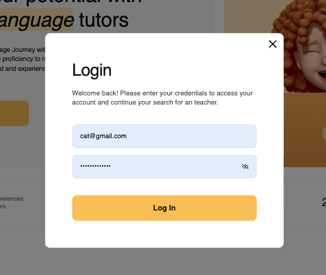
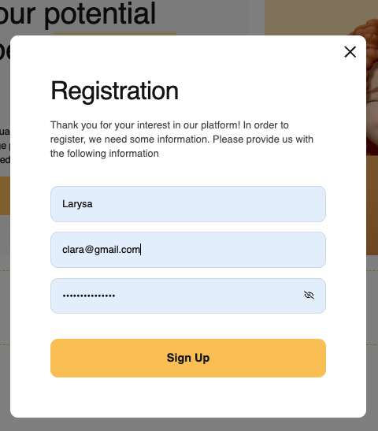
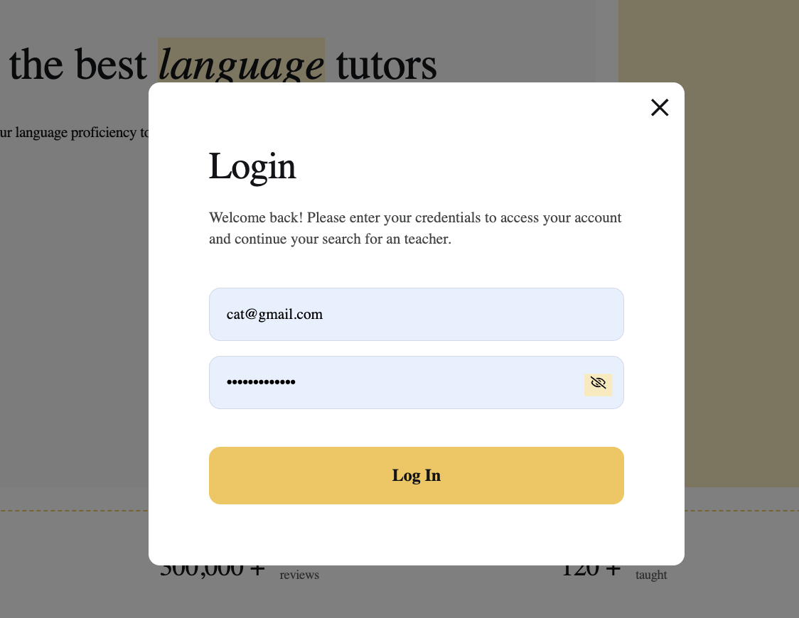

# Online Language Learning Platform

This project is a React-based web application designed for a company that offers online language learning services. The app consists of three pages, featuring user authentication, teacher listings, and a favorites section. Below, you'll find an overview of the project's purpose, core technologies, and functionality.

## Project Overview

### Purpose

The platform connects students with professional language teachers for online lessons. It provides an intuitive interface for exploring teacher profiles, filtering based on preferences, and booking trial lessons.

### Features

1. **Home Page**: Highlights company benefits and provides a call-to-action to explore teacher profiles.
   
2. **Teachers Page**: Displays a list of teachers with advanced filtering options (language, student level, price per hour) and functionality to load more profiles dynamically.
   
3. **Favorites Page**: A private section for logged-in users to view and manage their favorite teachers.
   

### Key Functionalities

- **User Authentication**: Registration, login, logout, and current user data management using Firebase Authentication.

- **Teacher Management**: Teachers' data stored in Firebase, with support for filtering and dynamic loading.
- **Favorites**: Ability to add/remove teachers to/from favorites, with state persistence.
- **Interactive Cards**: Teacher cards feature detailed information, a heart button for favorites, and a "Book Trial Lesson" button.
- **Forms with Validation**: Forms for authentication and booking lessons are created with `formik` and `yup` for validation.
  

- **Routing**: Navigation implemented with React Router for seamless transitions between pages.

## Technologies Used

- **Frontend**: React, React Router, TypeScript, Formik, yup
- **Backend**: Firebase Authentication, Firebase/Firestore Database
- **Styling**: CSS modules
- **Deployment**: Hosted on Firebase
- **Tooling**: Vite for building and bundling the application

## Project Design

- The UI follows a desktop-first.
- Layout: https://www.figma.com/design/dewf5jVviSTuWMMyU3d8Mc/Learn-Lingo?node-id=0-1&p=f&t=VEGDDk31YB2F1ybT-0.

## Technical Details

### Firebase Firestore Database Structure

Each teacher profile includes:

- `name`: Teacher's first name
- `surname`: Teacher's last name
- `languages`: Languages taught
- `levels`: Student proficiency levels handled
- `rating`: Average rating
- `reviews`: Number of reviews
- `price_per_hour`: Cost per lesson
- `lessons_done`: Total lessons completed
- `avatar_url`: URL of the teacher's avatar
- `lesson_info`: Lesson descriptions
- `conditions`: Teaching conditions
- `experience`: Years of teaching experience

## Getting Started

1. Clone the repository.
2. Install dependencies using `npm install`.
3. Run the app locally using `npm run dev`.
4. Build for production with `npm run build`.

## Author

- Name: Ira Prysiazhna
- [My GitHub Profile URL](https://github.com/PrysiazhnaIra)
- [My LinkedIn Profile URL](https://www.linkedin.com/in/ira-prysiazhna/)

---

# Онлайн-платформа для вивчення мов

Цей проєкт — це вебзастосунок на основі React, створений для компанії, яка пропонує послуги онлайн-навчання мовам. Додаток складається з трьох сторінок і включає аутентифікацію користувачів, список викладачів та розділ "Обрані". Нижче наведено огляд цілей проєкту, основних технологій і функціональних можливостей.

## Огляд проєкту

### Мета

Платформа з’єднує студентів із професійними викладачами мов для онлайн-занять. Вона забезпечує зручний інтерфейс для перегляду профілів викладачів, фільтрації за вподобаннями та бронювання пробних занять.

### Функції

1. **Головна сторінка**: Висвітлює переваги компанії та містить заклик до дії для перегляду профілів викладачів.
   
2. **Сторінка викладачів**: Відображає список викладачів із розширеними можливостями фільтрації (мова, рівень учнів, ціна за годину) та функцією динамічного завантаження профілів.
   
3. **Сторінка обраних**: Приватний розділ для авторизованих користувачів із можливістю перегляду та управління обраними викладачами.
   

### Основні можливості

- **Аутентифікація користувачів**: Реєстрація, вхід, вихід та управління даними поточного користувача за допомогою Firebase Authentication.
  
  
- **Управління викладачами**: Дані викладачів зберігаються в Firebase з підтримкою фільтрації та динамічного завантаження.
- **Обрані**: Можливість додавання/видалення викладачів до/з обраних із збереженням стану.
- **Інтерактивні картки**: Картки викладачів містять детальну інформацію, кнопку додавання в обрані та кнопку "Забронювати пробне заняття".
- **Форми з валідацією**: Форми для аутентифікації та бронювання занять створені за допомогою `formik` і `yup`.
  
- **Маршрутизація**: Навігація реалізована за допомогою React Router для плавного переходу між сторінками.

## Використані технології

- **Фронтенд**: React, React Router, formik, yup
- **Бекенд**: Firebase Authentication, Firebase Firestore Database
- **Стилізація**: CSS (унікальний дизайн на основі наданих прототипів)
- **Деплоймент**: Хостинг на Firebase
- **Інструменти**: Vite для збірки застосунку

## Дизайн проєкту

- Інтерфейс побудований із використанням підходу desktop-first.
- Макет: https://www.figma.com/design/dewf5jVviSTuWMMyU3d8Mc/Learn-Lingo?node-id=0-1&p=f&t=VEGDDk31YB2F1ybT-0.

## Технічні деталі

### Структура Firebase Firestore Database

Кожен профіль викладача включає:

- `name`: Ім’я викладача
- `surname`: Прізвище викладача
- `languages`: Мови викладання
- `levels`: Рівні знань учнів, з якими працює викладач
- `rating`: Середній рейтинг
- `reviews`: Кількість відгуків
- `price_per_hour`: Вартість уроку
- `lessons_done`: Загальна кількість проведених занять
- `avatar_url`: URL аватара викладача
- `lesson_info`: Опис уроків
- `conditions`: Умови викладання
- `experience`: Роки досвіду викладання

## Початок роботи

1. Склонуйте репозиторій.
2. Встановіть залежності за допомогою `npm install`.
3. Запустіть застосунок локально за допомогою `npm run dev`.
4. Зберіть для продакшну за допомогою `npm run build`.
